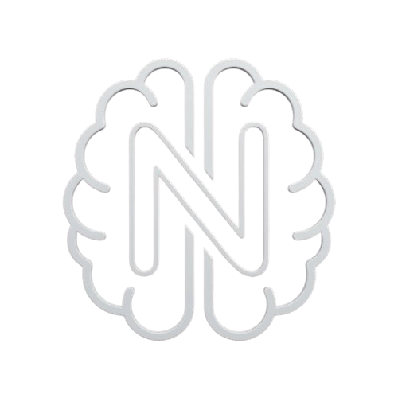

<p align="center">
  
</p>

<h1 align="center">NeuroKey</h1>

<p align="center">
  <b>Learn to code. Level up. Let your parents watch you grow.</b><br/>
  A gamified educational platform that connects kids, parents, and AI — in real time.
</p>

<p align="center">
  
  
  
  
  
</p>

---

## What is NeuroKey?

NeuroKey is a **three-part educational platform** built for a hackathon:

| Component | Tech | What it does |
|-----------|------|-------------|
| **Game** | Unity 2022.3 (URP) | First-person island adventure with C++ and Python coding challenges, quizzes, and optional BCI (brain-computer interface) integration |
| **Server** | Spring Boot 3.2 / Java 21 | WebSocket hub that syncs everything in real time — tasks, goals, AI profiles, code execution, and QR auth |
| **Parent App** | Kotlin / Jetpack Compose | Android app where parents track progress, set goals with rewards, view AI learning insights, and get notified when their child completes tasks |

**The core loop:** Student plays the game and solves coding challenges -> AI builds a learning profile from their interactions -> Parent sees strengths, struggles, and progress in real time.

---

## Key Features

**For Students (Unity Game)**
- Explore a 3D island with coding challenge pads (C++ debugging, Python visuals, function writing)
- 22 progressive tasks from beginner quizzes to writing factorial functions
- **Interactive logic puzzles**: On Island 3, players collect coins that open a real-time variable editor — they must figure out the right values to set (e.g. `jumpVelocity = 5`, `boxRigidbody = true`, `islandVisible = true`) to manipulate the game world and progress through 3 stages: adjusting jump power and enabling physics, revealing a hidden island, and unlocking a bridge path
- **Live code execution**: Students write C++ and Python code that gets sent to the server and executed in a sandboxed environment (Linux `unshare` with network isolation, memory/CPU/process limits via `ulimit`) — results come back in real time
- **AI-verified submissions**: After code runs, the output is sent to the AI which evaluates whether the solution is correct ("CORRECT" / "INCORRECT") with a short explanation — no hardcoded answer checking
- **AI hint chat**: Students can open a chat panel at any challenge and have a conversation with the AI mentor, which is aware of the current challenge context, the student's learning profile, and their language — responses are encouraging and concise
- Daily login streak tracked server-side
- Real-time progress bar showing task completion
- **Cross-platform**: runs on PC, Android, and VR
- **Brain-Computer Interface (optional)**: connects to a g.tec Unicorn Hybrid Black EEG headset to measure real-time concentration via beta/alpha brainwave ratio — displayed as a live focus meter in-game (see BCI section below)

**For Parents (Android App)**
- QR code scan to link with your child's game session
- Set custom goals with point thresholds or task requirements and rewards
- AI learning profiles with tiered detail: one-line summary -> three-line breakdown -> full stats popup
- Real-time system notifications when your child completes a task
- Task completion history grouped by date with daily stats
- Dark mode and color theme customization

**Server**
- **Sandboxed code execution**: Compiles and runs student C++ (`g++`) and Python (`python3`) code in isolated environments using Linux `unshare` (network dropped, separate user namespace) with strict `ulimit` constraints (256MB memory, capped CPU time, 64 max processes to prevent fork bombs, 2MB file size limit)
- **AI-powered code verification**: Student output is sent to the AI to determine correctness — no hardcoded expected outputs, so creative solutions that produce the right result are accepted
- Custom binary WebSocket protocol shared across all three platforms
- Multi-model AI fallback: Gemini 2.5 Flash -> Gemini 2.0 Flash -> Groq Llama 3.3 70B
- Per-topic learning profile generation (C++, Python, General) with strength/weakness analysis
- Context-aware AI chat: the mentor receives the student's learning profile summary so responses are tailored to their skill level and past struggles
- Response caching and per-model rate limit cooldowns
- QR-based authentication flow with session persistence
- Real-time goal push to connected game clients

---

## Architecture

```
┌─────────────────┐     Binary WebSocket     ┌──────────────────────┐
│   Unity Game    │◄────────────────────────►│   Spring Boot Server │
│  (C#, URP)      │      Port 49154          │  (Java 21, JPA)      │
└─────────────────┘                          └──────────┬───────────┘
                                                        │
┌─────────────────┐     Binary WebSocket               │
│  Android App    │◄───────────────────────────────────┘
│  (Kotlin,       │                            ┌───────────────────┐
│   Compose)      │                            │   PostgreSQL      │
└─────────────────┘                            │   + Gemini/Groq   │
                                               └───────────────────┘
```

- **Transport & Encryption**: Every packet is encrypted with **AES-256-CBC** using a dynamic seed system — each message generates a unique seed from `System.nanoTime()`, encrypts it with a shared base key, then encrypts the actual payload using the seed as the key. This means every single packet has a different encryption key, making replay attacks and traffic analysis impractical. The seed length is validated server-side to prevent out-of-memory attacks.
- **AI Learning Profiles**: The server builds a per-child, per-language (C++, Python, General) learning profile by aggregating every quiz answer, code submission, hint request, and AI chat turn. It tracks correct/incorrect counts per concept, identifies top strengths and struggle areas, catalogs common mistake patterns, and feeds all of this into Gemini/Groq to generate human-readable summaries at two detail levels (one-line and three-line). The profile is stored as JSONB and refreshed as new events arrive.
- **Database**: PostgreSQL with Hibernate auto-schema, JSONB columns for game stats and AI profiles
- **AI Fallback**: Cascading multi-provider system (Gemini 2.5 Flash -> 2.0 Flash -> Groq Llama 3.3 70B) with LRU cache (200 entries, 5 min TTL) and independent 60s cooldown timers per model after rate limits

---

## Brain-Computer Interface (BCI)

NeuroKey optionally integrates with the **g.tec Unicorn Hybrid Black** — a research-grade EEG headset — to add real-time neurofeedback to the learning experience. This is entirely optional; the game works fully without it.

**How it works:**
1. The `UnicornCompatibility` module auto-detects at startup whether the g.tec managed assemblies (`UnicornDotNet`, `Gtec.UnityInterface`) and native plugins are present — if not, BCI features are silently disabled
2. When a headset is connected, `EEGDataPipeline` streams raw brainwave samples at 250 Hz
3. The `FocusMeter` computes a **beta/alpha power ratio** using the **Goertzel algorithm** (efficient single-frequency DFT) over a ~1 second sliding window — beta waves (~20 Hz) indicate active concentration while alpha waves (~10 Hz) indicate relaxation
4. The ratio is scaled to a 0-100% focus percentage and displayed as a live overlay in the top-right corner of the screen

**What this enables:**
- Parents and teachers can see how focused a child actually is while solving challenges — not just whether they got the right answer
- The focus data can correlate with learning performance (e.g., did focus drop right before a wrong answer?)
- Cross-platform native plugin support: Windows DLL, macOS dylib, and Android .so are all handled

> The BCI integration works on PC and Android. The headset communicates via Bluetooth, and the Unity plugin handles device discovery and data streaming automatically.

---

## Cross-Platform

The Unity game is built to run on **PC, Android, and VR** from a single codebase:
- Desktop (Windows/macOS/Linux) with keyboard + mouse
- Android with touch controls (mobile UI helpers included via Starter Assets)
- VR headsets with standard Unity XR support

All platforms connect to the same server and use the same encrypted WebSocket protocol — a student can start a challenge on PC and their parent sees the progress on the Android app instantly.

---

## Quick Start

### Prerequisites

- **Java 21+** (Gradle wrapper included)
- **PostgreSQL** with a database named `neuroKey`
- **Android Studio** with SDK 36 (for the parent app)
- **Unity Hub** with **2022.3.62f3** installed

### 1. Database Setup

```bash
psql -h localhost -U postgres -c "CREATE DATABASE \"neuroKey\";"
psql -h localhost -U postgres -c "CREATE USER kawase WITH PASSWORD 'root';"
psql -h localhost -U postgres -c "GRANT ALL PRIVILEGES ON DATABASE \"neuroKey\" TO kawase;"
```

Or edit credentials in `java-server/Java-Server/src/main/resources/application.properties`.

### 2. Start the Server

```bash
cd java-server/Java-Server
./gradlew bootRun
```

The server starts on port **49154** and auto-creates all database tables on first run.

### 3. Configure AI (Optional)

Create `java-server/Java-Server/api-keys.json`:
```json
{
  "gemini_api_key": "your-gemini-key",
  "groq_api_key": "your-groq-key"
}
```

Or set environment variables: `GEMINI_API_KEY`, `GROQ_API_KEY`.

### 4. Run the Clients

**Android App:**
```bash
cd kotlin-app
./gradlew :app:installDebug
```
The server URL defaults to `wss://neuro.serenityutils.club` — update in `SocketViewModel` for local dev.

**Unity Game:**
1. Open `unity/NeuroKey` in Unity Hub
2. Load `Assets/Scenes/bci.unity`
3. Press Play

---

## Project Structure

```
NeuroKey/
├── java-server/Java-Server/
│   └── src/main/java/io/github/kawase/
│       ├── client/          # WebSocket client handling
│       ├── database/        # JPA entities, repos, services
│       │   ├── entity/      # Parent, Child, Task, Goal, CompletedTask
│       │   └── services/    # Business logic + AI profile generation
│       ├── packet/          # Binary protocol (auth, child, game, ai, qr)
│       ├── utility/         # GeminiAI (multi-model), HashUtility
│       └── Server.java      # Entry point
│
├── kotlin-app/app/src/main/java/io/github/kawase/
│   ├── ui/
│   │   ├── SocketViewModel.kt   # WebSocket + state management
│   │   ├── MainDashboard.kt     # Home, History, Goals, Settings screens
│   │   └── AuthScreen.kt        # Login / Register
│   ├── socket/packet/            # Client-side packet implementations
│   └── MainActivity.kt
│
└── unity/NeuroKey/Assets/
    ├── Scenes/              # Game scenes
    └── Scripts/
        ├── Runtime/
        │   ├── Network/     # PacketManager, GameClient
        │   ├── PauseMenuManager.cs    # In-game UI (tasks, goals, progress)
        │   ├── CppQuestionPadCinematic.cs
        │   ├── CodeChallengePadCinematic.cs
        │   └── PythonDebugPadCinematic.cs
        └── Editor/          # Scene building tools
```

---

## Packet Protocol

All three platforms share a binary WebSocket protocol. Each packet has a numeric ID and BigEndian-encoded fields:

| ID | Packet | Direction | Purpose |
|----|--------|-----------|---------|
| 1 | Handshake | Both | Connection init with encryption seed |
| 8 | CompleteTask | Client->Server | Mark a task as done |
| 9 | ActionResponse | Server->Client | Generic success/error response |
| 11-12 | FetchTasks | Both | Get available tasks |
| 13-14 | FetchGoals | Both | Get parent-set goals |
| 19-20 | QRLogin | Both | QR code auth flow |
| 22 | ChildAuth | Server->Client | Auth result with session token |
| 23-24 | ChildStats | Both | Points, streak, progress |
| 28-29 | ExecuteCPP | Both | Run C++ code server-side |
| 30-31 | AskAI | Both | AI mentor Q&A |
| 33 | RecordLearning | Client->Server | Track learning events |
| 34-35 | ExecutePython | Both | Run Python code server-side |

---

## Deployment

The server is **live 24/7** at `wss://neuro.serenityutils.club`, hosted on a VPS behind a **Cloudflare Tunnel** — no port forwarding or exposed IPs required. Both the Android app and Unity game connect to this by default, so you can demo the full flow without running anything locally.

## Highlights

- **Real-time triad**: Game, parent app, and server communicate over a single binary protocol — changes appear instantly across all clients
- **Custom encryption layer**: AES-256-CBC with a per-packet dynamic seed system — every message uses a unique key derived from a nanoTime seed that is itself encrypted with a shared base key, so no two packets share the same encryption key
- **Live sandboxed code execution**: Students write real C++ and Python in-game, code is compiled and run on the server in isolated Linux namespaces (`unshare --net`) with strict resource limits — fork bombs, infinite loops, and network access are all blocked at the OS level
- **AI-verified submissions**: No hardcoded answers — the AI reads the task, the student's code, and the program output to judge correctness, so creative solutions that produce the right result are accepted
- **AI learning profiles**: Not just tracking scores — the server aggregates every interaction (quiz answers, code submissions, hints, chat turns) into per-language profiles that identify specific concept strengths, struggle areas, and common mistake patterns, then generates human-readable AI summaries
- **Context-aware AI chat**: Students can ask the AI for help at any challenge — the mentor knows the current task, the student's code, and their learning profile, so hints are tailored rather than generic
- **Cross-platform game**: The Unity game builds for PC, Android, and VR from a single codebase — same coding challenges and server connection on every platform
- **Brain-Computer Interface**: Optional g.tec Unicorn Hybrid Black EEG integration that reads real brainwave data, computes a beta/alpha power ratio using the Goertzel algorithm, and displays a live focus percentage overlay — giving parents and teachers real-time insight into how concentrated a child is while learning
- **Privacy by design**: Credentials hashed client-side before transmission, all traffic AES-encrypted, WebSocket-only communication, no third-party analytics
- **Production touches**: Multi-model AI fallback with rate limiting, session persistence, auto-reconnection, system notifications, daily streaks

---

## Contributing

Open issues/PRs per component. Keep third-party asset licenses intact (Unity art packs, g.tec SDK, Starter Assets). Avoid committing secrets — use `api-keys.json` (gitignored) or environment variables.
